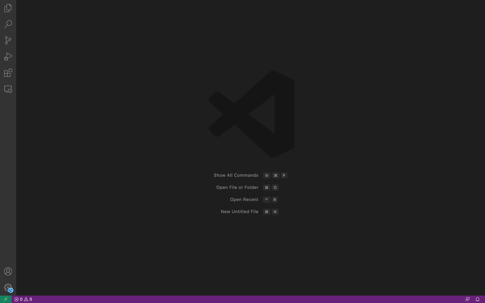
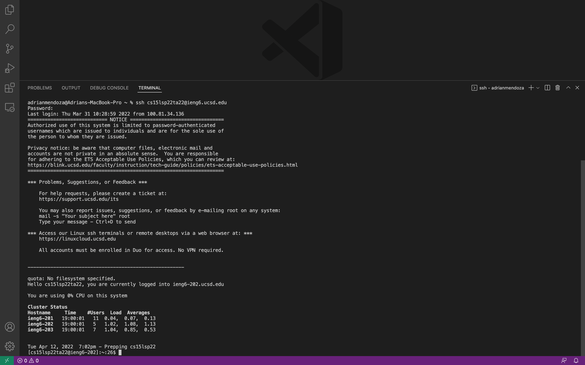
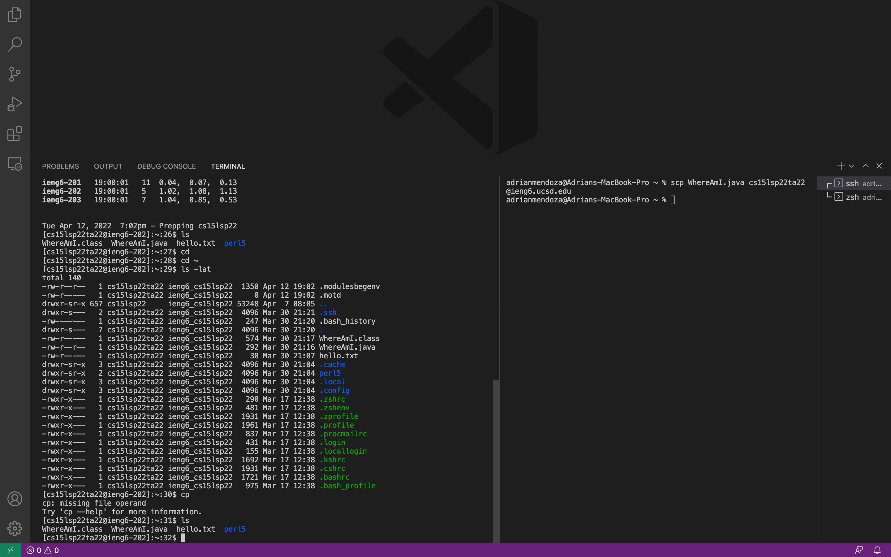
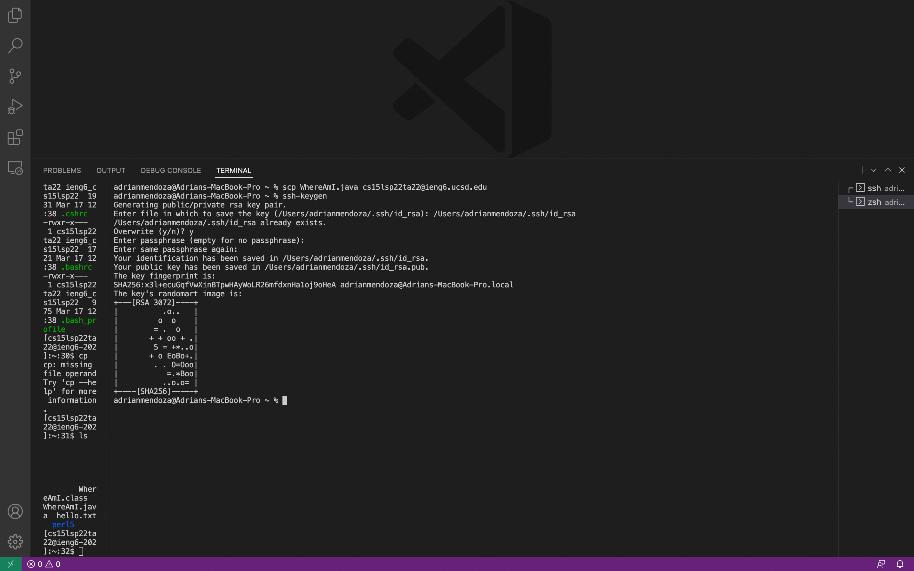
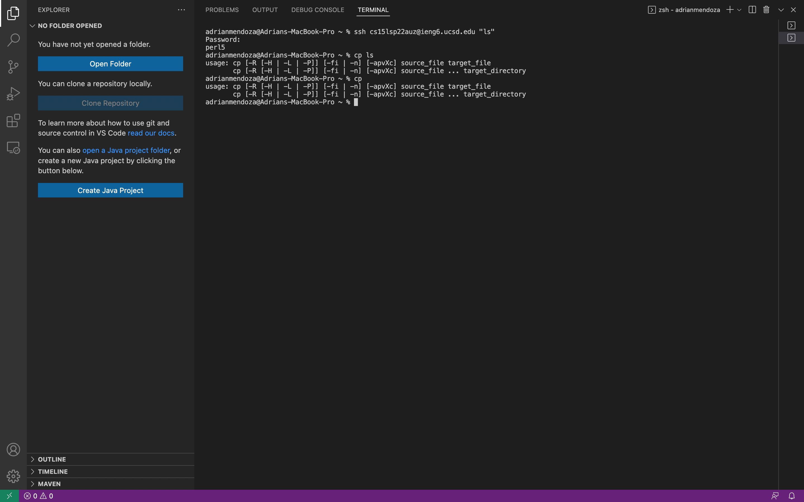

# Installing VScode

* Download VScode for Mac from the VScode website [here](https://code.visualstudio.com)

# Remotely Connecting

* Look up course-specific account [here](https://sdacs.ucsd.edu/~icc/index.php)
* Open terminal in VScode and type in "$ ssh cs15lsp22auz@ieng6.ucsd.edu"
* Type in "yes" followed by the password

# Trying Some Commands

* Run some commands like "ls", "cd", and "pwd"
* "Ctrl + D" or "exit" to log out of remote server

# Moving Files with scp

* Create new file (i.e. WhereAmI.java) on computer (not logged onto server)
* Run " scp WhereAmI.java cs15lsp22zz@ieng6.ucsd.edu:~/ "  
* Log into ieng6 using ssh and use ls
* File should be displayed in home directory

# Setting Up An SSH Key

* Run the command "ssh-keygen"
* Save the key in a file like "/Users/<user-name>/.ssh/id_rsa" and type "y" to overwrite
* Log onto server and run "mkdir .ssh" then log out

# Optimizing Remote Running

* You can log in and run a command in the same line
* You can run multiple commands at once
* Use up arrow to recall last command
